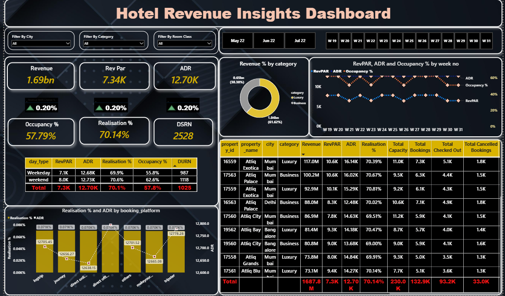

# Hotel_Revenue_Insights
# 🏨 Hotel Revenue Insights Dashboard

## 📌 Project Overview

The **Hotel Revenue Insights Dashboard** is an end-to-end data analytics project developed to analyze hotel booking and revenue performance. The project transforms raw booking data into meaningful business insights using SQL, Python, and Power BI, helping stakeholders make informed decisions related to occupancy, revenue, and customer behavior.

---

## 🎯 Objectives

* Analyze hotel booking trends.
* Monitor revenue performance across hotels.
* Measure occupancy and booking efficiency.
* Identify cancellation patterns.
* Build an interactive dashboard for business decision-making.

---

## 🛠️ Tech Stack

* **MySQL** – Database creation, data modeling, and SQL analysis
* **Python**

  * Pandas
  * NumPy
  * SQLAlchemy
  * PyMySQL
* **Power BI**
* **DAX**
* **Git & GitHub**

---

## 📂 Dataset

The dataset contains hotel booking information, including:

* Hotels
* Rooms
* Booking details
* Booking dates
* Revenue
* Occupancy information

### Main Tables

* `dim_date`
* `dim_hotels`
* `dim_rooms`
* `fact_bookings`
* `fact_aggregated_bookings`

---

## 🗄️ Database Design

The database was designed using a dimensional data model consisting of fact and dimension tables to support efficient analytical queries.

### Data Model

* Fact Tables

  * `fact_bookings`
  * `fact_aggregated_bookings`

* Dimension Tables

  * `dim_hotels`
  * `dim_rooms`
  * `dim_date`

---

## ⚙️ ETL Process

* Imported CSV datasets using Python.
* Cleaned and transformed the data using Pandas.
* Loaded data into MySQL.
* Built relationships between fact and dimension tables.
* Connected the database to Power BI for visualization.

---

## 📊 Dashboard Features

The dashboard provides interactive insights into:

* Total Revenue
* Occupancy Rate
* ADR (Average Daily Rate)
* RevPAR (Revenue Per Available Room)
* Booking Trends
* Cancellation Analysis
* Hotel-wise Performance
* Room Category Analysis
* Weekly and Monthly Revenue Trends

---

## 📈 Key Business Insights

* Identified top-performing hotels based on revenue.
* Compared occupancy rates across different room categories.
* Analyzed booking and cancellation trends.
* Evaluated revenue performance over time.
* Supported data-driven decision-making through interactive dashboards.

---

## 📁 Project Structure

```text
Hotel-Revenue-Insights/
│
├── data/
├── sql/
├── powerbi/
├── images/
├── requirements.txt
└── README.md
```

---

## 🚀 How to Run

1. Clone the repository.
2. Import the SQL scripts into MySQL.
3. Load the dataset into the database.
4. Open the Power BI (`.pbix`) file.
5. Refresh the data connection if required.

---

## 📸 Dashboard Preview





---

## 💡 Skills Demonstrated

* SQL Query Writing
* Data Modeling
* ETL Pipeline
* Data Cleaning
* Data Analysis
* Business Intelligence
* Dashboard Development
* Data Visualization
* Power BI
* DAX
* Python
* Git & GitHub

---

## 📬 Contact

**Pankaj Jangir**

* LinkedIn: www.linkedin.com/in/pankaj-jangir-99ab9b385

---

⭐ If you found this project interesting, feel free to star the repository and connect with me on LinkedIn.
